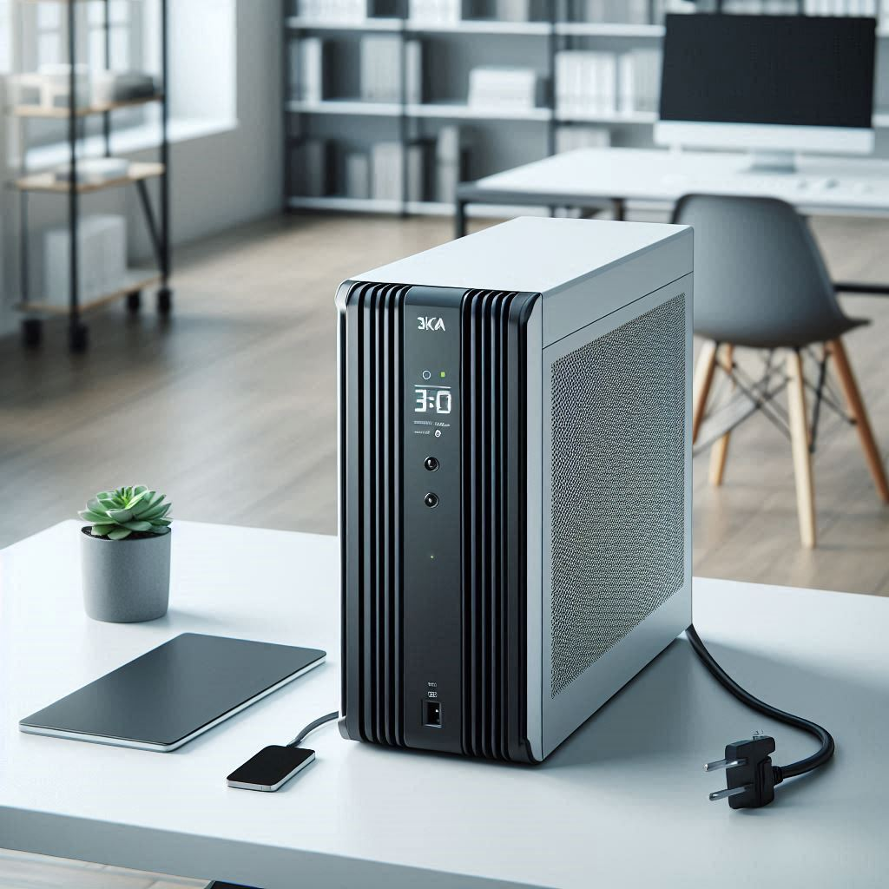

# Reporte_UPS

<!---->

# Descripcion General

Base de datos para llevar control de los mantenimientos realizados a las UPS de diferentes clientes.

# Contenido

Esta base de datos tiene la siguientes tablas:

1. Reporte, donde se guardara toda la informacion de los mantenimeintos
2. Clientes
3. Tipo_Mtto

